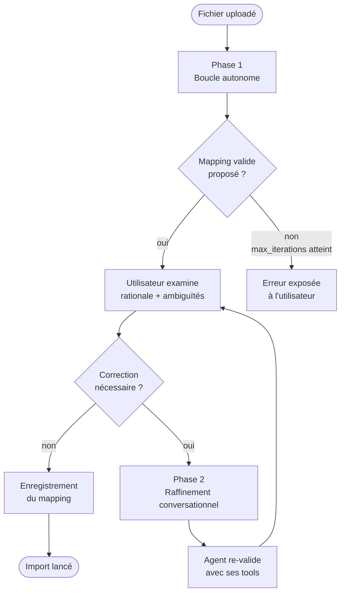
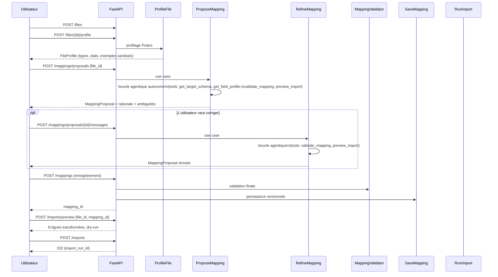

# AgentLen — Architecture de l'agent IA d'import

> Document de référence pour le lot D (agent IA).
> Documents liés : [ARCHITECTURE.md](ARCHITECTURE.md) §9 · [MAPPING_CONTRACT.md](MAPPING_CONTRACT.md) · [API.md](API.md) §3

---

## 1. Objet

Ce document décrit l'architecture de l'**agent IA d'aide à l'import** : le composant
qui analyse un fichier inconnu, propose un mapping et affine sa proposition en échangeant
avec l'utilisateur.

L'agent n'est pas un chatbot avec historique de messages. C'est une **boucle agentique**
dans laquelle le modèle appelle des outils pour obtenir des informations réelles avant
de produire sa proposition. L'utilisateur n'intervient qu'après que l'agent a convergé
vers un mapping valide de son propre chef.

---

## 2. Positionnement dans les quatre couches

```
domain/          ← MappingProposal, FieldRule, Operator — résultat de l'agent
application/     ← port StructureAnalyzer, ToolExecutor, use cases
infrastructure/  ← AnthropicAnalyzer, OpenAIAnalyzer, FakeAnalyzer, factory
interfaces/      ← routes FastAPI /mappings/proposals et /mappings/proposals/{id}/messages
```

Le modèle (Claude, GPT-4, local…) est un détail d'infrastructure.
Ni le domaine ni les use cases n'y font référence.

---

## 3. Les deux phases d'une session d'import



**Phase 1 — Boucle autonome :** le modèle appelle des outils sans intervention humaine
jusqu'à produire un `MappingProposal` valide ou épuiser `MAX_ITERATIONS`.

**Phase 2 — Raffinement conversationnel :** l'utilisateur envoie un message de correction,
l'agent re-valide le mapping modifié avec ses tools avant de répondre.
Les deux phases partagent la même boucle interne.

---

## 4. Boucle agentique

```mermaid
sequenceDiagram
    participant UC  as ProposeMapping\n(use case)
    participant Loop as run_agent_loop\n(base adapter)
    participant LLM  as Modèle LLM
    participant TE   as ToolExecutor
    participant UC2  as Use cases existants

    UC->>Loop: messages + tools + tool_executor
    loop Jusqu'à end_turn ou max_iterations
        Loop->>LLM: messages + schémas des tools
        alt stop_reason = tool_use
            LLM-->>Loop: [tool_use: validate_mapping(...)]
            Loop->>TE: execute("validate_mapping", input)
            TE->>UC2: MappingValidator.validate(doc)
            UC2-->>TE: {valid: false, errors: [...]}
            TE-->>Loop: résultat JSON
            Loop->>LLM: tool_result (ajouté aux messages)
        else stop_reason = end_turn
            LLM-->>Loop: MappingProposal finale
            Loop-->>UC: AgentResult
        end
    end
```

**Invariants :**

1. Le LLM ne voit jamais la base de données — il reçoit uniquement des profils,
   des échantillons sanitisés et des résultats de validation.
2. Chaque appel de tool passe par `ToolExecutor` : le modèle ne peut pas invoquer
   autre chose que les tools déclarés.
3. Le `MappingProposal` produit par le LLM est **toujours** revalidé par
   `MappingValidator` avant d'être retourné au use case — même si `validate_mapping`
   a déjà été appelé pendant la boucle.

---

## 5. Tools disponibles

L'agent dispose de cinq tools, déclarés une seule fois et sans dépendre du
fournisseur dans `infrastructure/ai/agent_tools.py` (`TOOL_NAMES`,
`IMPORT_AGENT_TOOLS`). `to_anthropic()` et `to_openai()` les convertissent au
format de chaque API : l'ensemble ne peut pas diverger d'un fournisseur à l'autre.
Aucun autre tool n'est exécuté (voir §6). Les schémas ci-dessous sont recopiés du
code, descriptions comprises.

Aucun tool ne prend de `file_id` : l'exécuteur est construit sur le `FileProfile`
du fichier, **déjà passé par le `ProfileSanitizer`**, et ne lit rien d'autre que
ce profil et le validateur du domaine.

### `get_target_schema`

Retourne les entités qu'un mapping peut cibler : `{"entities": [...]}`, triées,
lues dans `mapping_validator.VALID_TARGETS`. Seuls les noms d'entités sont
renvoyés aujourd'hui, pas leurs champs, même si la description les annonce.

```json
{
  "name": "get_target_schema",
  "description": "Return the AgentLen target entities and their fields. Call this before proposing any mapping: a field that is not in this schema will be rejected by the validator.",
  "input_schema": { "type": "object", "properties": {}, "required": [] }
}
```

### `get_field_profile`

Le profil d'**un** champ source, désigné par son chemin : types observés, taux
de null, ratio de valeurs distinctes, min et max. Un chemin absent du profil
renvoie `{"error": "Field not found"}`.

```json
{
  "name": "get_field_profile",
  "description": "Return detailed statistics for one source field: observed types, null ratio, distinct ratio, min and max. Use it to decide whether a field can serve as a natural key.",
  "input_schema": {
    "type": "object",
    "properties": {
      "path": { "type": "string", "description": "JSONPath, e.g. $.usage.input_tokens" }
    },
    "required": ["path"]
  }
}
```

### `get_sample_values`

Quelques valeurs d'un champ, prises dans les exemples du profil sanitisé, pour
lever une ambiguïté d'unité ou de format (secondes ou millisecondes…). `limit`
vaut 3 par défaut et l'exécuteur le plafonne à **10**, quoi que demande le modèle.
Un chemin absent du profil renvoie `{"error": "Field not found"}`.

```json
{
  "name": "get_sample_values",
  "description": "Return a few real, redacted values for one field, to settle an ambiguity the statistics cannot — seconds versus milliseconds, for instance.",
  "input_schema": {
    "type": "object",
    "properties": {
      "path":  { "type": "string" },
      "limit": { "type": "integer", "description": "At most 10." }
    },
    "required": ["path"]
  }
}
```

### `validate_mapping`

Convertit le document en `Mapping` puis le valide avec `mapping_validator` du
domaine. Retourne `{"valid": …, "errors": [{"code", "field_path", "message"}]}` ;
un document qui ne se convertit même pas renvoie `valid: false` avec une erreur
sur `mapping`. **À appeler avant de répondre.**

```json
{
  "name": "validate_mapping",
  "description": "Validate a complete mapping document. Returns the full list of errors with their codes and field paths. Call this before answering: an invalid mapping will be refused anyway.",
  "input_schema": {
    "type": "object",
    "properties": { "mapping": { "type": "object" } },
    "required": ["mapping"]
  }
}
```

### `preview_import`

Déclaré, mais **pas encore branché** pendant la proposition : l'exécuteur répond
toujours `{"error": "Preview requires a saved mapping"}`. Le dry-run réel passe
par `POST /imports/preview`, sur un mapping enregistré (§9).

```json
{
  "name": "preview_import",
  "description": "Dry-run the mapping over a few records and report what it would produce and what it would reject. Writes nothing.",
  "input_schema": {
    "type": "object",
    "properties": {
      "mapping":     { "type": "object" },
      "sample_size": { "type": "integer" }
    },
    "required": ["mapping"]
  }
}
```

---

## 6. ToolExecutor — isolation et sécurité

Le LLM demande un tool, l'exécuteur décide s'il existe et comment l'exécuter.
Trois fichiers, un par rôle :

| Fichier | Rôle |
|---|---|
| `application/ports/tool_executor.py` | Port `ImportAgentToolExecutor` : `execute(tool_name, tool_input) -> dict`, ne lève jamais |
| `application/use_cases/propose_mapping.py` | `MappingValidationTools`, la seule implémentation, construite sur le profil sanitisé ; utilisée par `ProposeMapping` et par `RefineMapping` (`refine_mapping.py`) |
| `infrastructure/ai/base.py` | Boucle agentique commune aux adaptateurs : chaque appel demandé par le modèle part vers `tool_executor.execute(...)` |

```
MappingValidationTools.execute(tool_name, tool_input) -> dict
  └── "get_field_profile"  →  FieldProfile du chemin, ou {"error": "Field not found"}
  └── "get_sample_values"  →  exemples du profil (limit ≤ 10), ou {"error": "Field not found"}
  └── "get_target_schema"  →  {"entities": sorted(mapping_validator.VALID_TARGETS)}
  └── "validate_mapping"   →  mapping_validator.validate(document_to_mapping(...))
  └── "preview_import"     →  {"error": "Preview requires a saved mapping"}
  └── tout autre nom       →  {"error": "Tool not available"}
```

**Garanties :**

- La whitelist est la suite de branches explicites de `execute` : un tool non
  déclaré retourne `{"error": "Tool not available"}`, jamais une exception.
- Les tools ne lisent que le profil sanitisé reçu à la construction et le
  validateur du domaine : ni base, ni système de fichiers, ni réseau.
- `import-linter` (contrat « Application depends on ports, never on adapters »)
  interdit à tout `agentlen.application`, donc à `propose_mapping.py`, d'importer
  `agentlen.infrastructure`, `sqlalchemy`, `polars`, `anthropic` ou `openai`.

---

## 7. Politique de contexte

| Paramètre | Valeur | Raison |
|---|---|---|
| `MAX_ITERATIONS` | `10` | Évite une boucle infinie si le modèle ne converge pas |
| `MAX_CONVERSATION_TURNS` | `10` | Limite la taille du contexte en phase de raffinement |
| Fenêtre glissante | 5 derniers tours | Au-delà, le contexte déborde sur les modèles à petite fenêtre |
| Taille max de l'échantillon envoyé au LLM | `50 lignes` | Défini dans `SampleSanitizer`, jamais le fichier entier |

Si `MAX_ITERATIONS` est atteint sans `end_turn`, le use case lève
`AgentMaxIterationsError`. L'API retourne `502` avec un message explicatif ;
l'utilisateur peut relancer avec un `hint` plus précis.

---

## 8. FakeAnalyzer — substitut de test

`FakeAnalyzer` dans `infrastructure/ai/fake_adapter.py` simule une boucle
à deux itérations à partir de fixtures, **sans aucun appel réseau**.

```
tests/fixtures/ai_responses/
├── fake_tool_use_turn.json      # tour 1 : tool_use validate_mapping
├── fake_tool_result.json        # résultat retourné par ToolExecutor
└── fake_end_turn.json           # tour 2 : end_turn + MappingProposal finale
```

La CI ne requiert aucune clé API. Les deux configurations réelles
(Anthropic + OpenAI) sont vérifiées manuellement et consignées dans
`docs/verification/ai-models-report.md`.

---

## 9. Séquence complète — de l'upload à l'import


