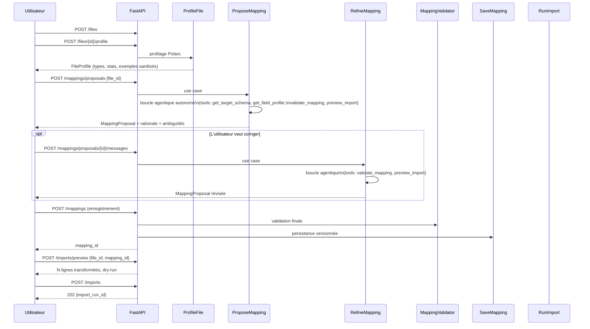

# AgentLen — Architecture de l'agent IA d'import

> Document de référence pour le lot D (agent IA).
> Documents liés : [ARCHITECTURE.md](ARCHITECTURE.md) §9 · [MAPPING_CONTRACT.md](MAPPING_CONTRACT.md) · [API.md](API.md) §3

---

## 1. Objet

Ce document décrit l'architecture de l'**agent IA d'aide à l'import** : le composant
qui analyse un fichier inconnu, propose un mapping et affine sa proposition en échangeant
avec l'utilisateur.

L'agent n'est pas un chatbot avec historique de messages. C'est une **boucle agentique**
dans laquelle le modèle appelle des outils pour obtenir des informations réelles avant
de produire sa proposition. L'utilisateur n'intervient qu'après que l'agent a convergé
vers un mapping valide de son propre chef.

---

## 2. Positionnement dans les quatre couches

```
domain/          ← MappingProposal, FieldRule, Operator — résultat de l'agent
application/     ← port StructureAnalyzer, ToolExecutor, use cases
infrastructure/  ← AnthropicAnalyzer, OpenAIAnalyzer, FakeAnalyzer, factory
interfaces/      ← routes FastAPI /mappings/proposals et /mappings/proposals/{id}/messages
```

Le modèle (Claude, GPT-4, local…) est un détail d'infrastructure.
Ni le domaine ni les use cases n'y font référence.

Une requête peut choisir son fournisseur et son modèle (API.md §3). `AI_BASE_URL`
ne vaut que pour le fournisseur configuré (`settings_for_request`,
`infrastructure/ai/factory.py`) : un autre fournisseur utilise le point d'accès par
défaut de son adaptateur, pour qu'une clé ne parte jamais vers l'hôte d'un autre
fournisseur. Un fournisseur hors du registre est refusé en `400` par le schéma de la
requête, avant toute construction d'adaptateur.

---

## 3. Les deux phases d'une session d'import


**Phase 1 — Boucle autonome :** le modèle appelle des outils sans intervention humaine
jusqu'à produire un `MappingProposal` valide ou épuiser `MAX_ITERATIONS`.

**Phase 2 — Raffinement conversationnel :** l'utilisateur envoie un message de correction,
l'agent re-valide le mapping modifié avec ses tools avant de répondre.
Les deux phases partagent la même boucle interne.

---

## 4. Boucle agentique

```mermaid
sequenceDiagram
    participant UC  as ProposeMapping\n(use case)
    participant Loop as run_agent_loop\n(base adapter)
    participant LLM  as Modèle LLM
    participant TE   as ToolExecutor
    participant UC2  as Use cases existants

    UC->>Loop: messages + tools + tool_executor
    loop Jusqu'à end_turn ou max_iterations
        Loop->>LLM: messages + schémas des tools
        alt stop_reason = tool_use
            LLM-->>Loop: [tool_use: validate_mapping(...)]
            Loop->>TE: execute("validate_mapping", input)
            TE->>UC2: MappingValidator.validate(doc)
            UC2-->>TE: {valid: false, errors: [...]}
            TE-->>Loop: résultat JSON
            Loop->>LLM: tool_result (ajouté aux messages)
        else stop_reason = end_turn
            LLM-->>Loop: MappingProposal finale
            Loop-->>UC: AgentResult
        end
    end
```

**Invariants :**

1. Le LLM ne voit jamais la base de données — il reçoit uniquement des profils,
   des échantillons sanitisés et des résultats de validation. Les résultats de tools
   lui reviennent clôturés comme données (`wrap_as_data`), comme le profil.
2. Chaque appel de tool passe par `ToolExecutor` : le modèle ne peut pas invoquer
   autre chose que les tools déclarés. Des arguments malformés lui reviennent en
   `{"error": ...}` ; une réponse finale ou un corps de réponse mal formé donne un `502`.
3. Le `MappingProposal` produit par le LLM est **toujours** revalidé par
   `MappingValidator` avant d'être retourné au use case — même si `validate_mapping`
   a déjà été appelé pendant la boucle.

---

## 5. Tools disponibles

L'agent dispose de cinq tools. Aucun autre ne peut être appelé
(voir `ToolExecutor` §6).

### `get_target_schema`

Retourne la description complète du schéma cible : entités, champs, types,
contraintes et opérateurs disponibles. À appeler **une seule fois** en début
de boucle.

```json
{
  "name": "get_target_schema",
  "description": "Retourne le schéma cible complet (entités, champs, types, contraintes) et la whitelist des opérateurs disponibles.",
  "input_schema": { "type": "object", "properties": {} }
}
```

### `get_field_profile`

Statistiques détaillées d'un ou plusieurs champs du fichier source :
types observés, taux de null, min/max, cardinalité, exemples sanitisés.
À appeler avant de choisir un opérateur de conversion.

```json
{
  "name": "get_field_profile",
  "description": "Statistiques détaillées d'un ou plusieurs champs (types, null_ratio, min/max, exemples). Appeler avant de proposer un opérateur de conversion.",
  "input_schema": {
    "type": "object",
    "properties": {
      "file_id":     { "type": "integer" },
      "field_paths": { "type": "array", "items": { "type": "string" },
                       "description": "JSONPath des champs, ex: ['$.duration', '$.usage.input_tokens']" }
    },
    "required": ["file_id", "field_paths"]
  }
}
```

### `get_sample_values`

N valeurs réelles (sanitisées par `SampleSanitizer`) d'un champ précis.
Utile pour lever une ambiguïté d'unité ou de format (secondes vs millisecondes,
format de date…).

```json
{
  "name": "get_sample_values",
  "description": "Retourne N valeurs réelles sanitisées d'un champ pour lever une ambiguïté (unité, format de date, valeurs possibles).",
  "input_schema": {
    "type": "object",
    "properties": {
      "file_id":    { "type": "integer" },
      "field_path": { "type": "string" },
      "n":          { "type": "integer", "default": 20, "maximum": 50 }
    },
    "required": ["file_id", "field_path"]
  }
}
```

### `validate_mapping`

Valide un document de mapping en quatre niveaux (syntaxique, sémantique,
structurel, exécution à blanc). Retourne la liste complète des erreurs
localisées. **Doit être appelé avant de produire la proposition finale.**

```json
{
  "name": "validate_mapping",
  "description": "Valide un document de mapping (schéma + whitelist + champs cibles + exécution à blanc). Retourne toutes les erreurs avec leur localisation. TOUJOURS appeler avant end_turn.",
  "input_schema": {
    "type": "object",
    "properties": {
      "mapping": { "type": "object", "description": "Le document de mapping complet (voir MAPPING_CONTRACT.md §2)" }
    },
    "required": ["mapping"]
  }
}
```

### `preview_import`

Dry-run du mapping sur un échantillon : retourne les entités qui seraient
produites et les rejets détaillés. **Aucune écriture en base.** Permet à
l'agent de vérifier le résultat concret avant de conclure.

```json
{
  "name": "preview_import",
  "description": "Dry-run du mapping sur N lignes. Retourne les entités produites et les rejets détaillés. Aucune écriture en base.",
  "input_schema": {
    "type": "object",
    "properties": {
      "file_id":     { "type": "integer" },
      "mapping":     { "type": "object" },
      "sample_size": { "type": "integer", "default": 20, "maximum": 100 }
    },
    "required": ["file_id", "mapping"]
  }
}
```

---

## 6. ToolExecutor — isolation et sécurité

`ImportAgentToolExecutor` vit dans `application/use_cases/`. C'est le seul
point d'exécution des tools : le LLM demande, le ToolExecutor décide si
c'est autorisé et comment l'exécuter.

```
application/use_cases/agent_tool_executor.py

ALLOWED_TOOLS = {
    "get_target_schema",
    "get_field_profile",
    "get_sample_values",
    "validate_mapping",
    "preview_import",
}

execute(tool_name, tool_input) -> dict
  └── tool_name ∉ ALLOWED_TOOLS  →  {"error": "Tool not available"}
  └── tool_name == "validate_mapping"  →  MappingValidator.validate(...)
  └── tool_name == "preview_import"    →  PreviewImport use case
  └── tool_name == "get_field_profile" →  FileProfiler port
  └── ...
```

**Garanties :**

- Un tool non déclaré retourne une erreur JSON — jamais une exception non gérée.
- Les tools accèdent aux données via les **ports existants** et les **use cases existants**,
  jamais directement à SQLAlchemy ou au système de fichiers.
- `import-linter` vérifie que `agent_tool_executor.py` n'importe pas
  `sqlalchemy`, `polars` ou tout SDK IA.

---

## 7. Politique de contexte

| Paramètre | Valeur | Raison |
|---|---|---|
| `MAX_ITERATIONS` | `10` | Évite une boucle infinie si le modèle ne converge pas |
| `MAX_CONVERSATION_TURNS` | `10` | Limite la taille du contexte en phase de raffinement |
| `AI_TOTAL_TIMEOUT_SECONDS` | `540` | Délai total d'une proposition ou d'un raffinement, toutes itérations et tentatives comprises ; sous les 600 s du proxy nginx |
| Fenêtre glissante | 5 derniers tours | Au-delà, le contexte déborde sur les modèles à petite fenêtre |
| Taille max de l'échantillon envoyé au LLM | `50 lignes` | Défini dans `SampleSanitizer`, jamais le fichier entier |

Si `MAX_ITERATIONS` est atteint sans `end_turn`, le use case lève
`AgentMaxIterationsError`. L'API retourne `502` avec un message explicatif ;
l'utilisateur peut relancer avec un `hint` plus précis.

`AI_TIMEOUT_SECONDS` borne un appel, `MAX_ITERATIONS` une boucle, mais leur produit
avec les tentatives atteint une quarantaine de minutes. `AI_TOTAL_TIMEOUT_SECONDS`
borne l'ensemble. `DeadlineBoundAnalyzer` (`application/use_cases/analysis_deadline.py`)
enveloppe l'unique appel à l'analyseur de `ProposeMapping` et de `RefineMapping`, et
`interfaces/http/dependencies.py` l'applique à chaque analyseur construit. À
l'échéance, l'appel est annulé, rien n'est enregistré, et l'API retourne `504`
`ANALYZER_TIMEOUT`. Sans ce délai, le proxy répondait `504` pendant que l'analyse
continuait à consommer des jetons.

---

## 8. FakeAnalyzer — substitut de test

`FakeAnalyzer` dans `infrastructure/ai/fake_adapter.py` simule une boucle
à deux itérations à partir de fixtures, **sans aucun appel réseau**.

```
tests/fixtures/ai_responses/
├── fake_tool_use_turn.json      # tour 1 : tool_use validate_mapping
├── fake_tool_result.json        # résultat retourné par ToolExecutor
└── fake_end_turn.json           # tour 2 : end_turn + MappingProposal finale
```

La CI ne requiert aucune clé API. Les deux configurations réelles
(Anthropic + OpenAI) sont vérifiées manuellement et consignées dans
`docs/verification/ai-models-report.md`.

---

## 9. Séquence complète — de l'upload à l'import


