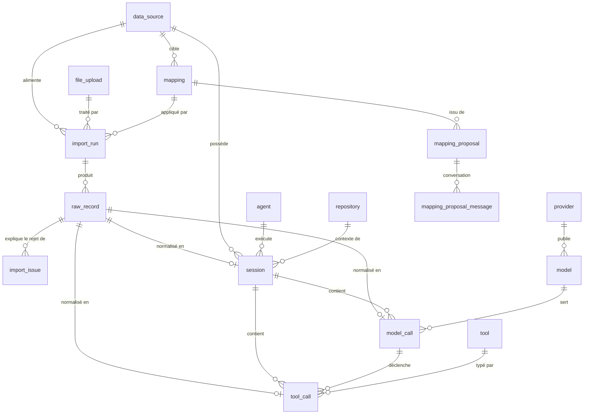

# AgentLen — Modèle de données

> Cible : **3NF justifiée**, provenance conservée ligne à ligne, réimport idempotent.
> Voir aussi : [ARCHITECTURE.md](ARCHITECTURE.md) · [MAPPING_CONTRACT.md](MAPPING_CONTRACT.md)

---

## 1. Vue d'ensemble

Le modèle se lit en quatre blocs :

| Bloc | Tables | Rôle |
|---|---|---|
| **Provenance** | `data_source`, `file_upload`, `import_run`, `raw_record`, `import_issue` | D'où vient chaque donnée et ce qui s'est passé à l'import |
| **Référentiels** | `provider`, `model`, `agent`, `tool`, `repository` | Élimination des dépendances transitives (3NF) |
| **Faits** | `session`, `model_call`, `tool_call` | Les trois niveaux exigés par le sujet |
| **Mapping** | `mapping`, `mapping_proposal`, `mapping_proposal_message` | Configuration d'import réutilisable + traçabilité IA |



---

## 2. Grain de chaque table

**Point exigé explicitement par le sujet : « Précisez ce que représente une ligne dans chaque table. »**

| Table | Une ligne = |
|---|---|
| `data_source` | Un jeu de données externe identifié (TraceLab, SWE-chat, Trace Commons…), avec sa version et sa date de récupération |
| `file_upload` | Un fichier physique déposé, identifié par son SHA-256 |
| `import_run` | Une exécution d'import : un fichier × un mapping × un instant |
| `raw_record` | **Un enregistrement source tel quel** (une ligne JSONL, une ligne CSV, une ligne Parquet) avant toute transformation |
| `import_issue` | Un problème rencontré sur un `raw_record` : rejet, doublon, ou information manquante |
| `provider` | Un fournisseur de modèles (anthropic, openai, google…) |
| `model` | Un modèle identifié chez un fournisseur |
| `agent` | Un agent de développement observé (claude-code, codex…) |
| `tool` | Un outil invocable, par son nom canonique (`Read`, `Bash`, `Edit`…) |
| `repository` | Un dépôt de code servant de contexte à une session |
| `session` | **Une session de travail d'un agent**, du début à la fin |
| `model_call` | **Un appel à un modèle** au sein d'une session (une requête/réponse d'inférence) |
| `tool_call` | **Une invocation d'outil** au sein d'une session, éventuellement rattachée à l'appel modèle qui l'a demandée |
| `mapping` | Une version d'une configuration d'import, applicable et réutilisable |
| `mapping_proposal` | Une proposition produite par un modèle IA pour un fichier donné, avec le descripteur du modèle utilisé |
| `mapping_proposal_message` | Un tour de conversation entre l'utilisateur et l'agent d'import |
| `user` | Une personne capable de s'authentifier contre l'API (e-mail + mot de passe) |
| `user_session` | Une connexion active, identifiée par son jeton de session opaque |

---

## 3. Provenance

```sql
CREATE TABLE data_source (
    id              BIGINT GENERATED ALWAYS AS IDENTITY PRIMARY KEY,
    slug            TEXT        NOT NULL UNIQUE,   -- 'tracelab', 'swe-chat'
    name            TEXT        NOT NULL,
    description     TEXT,
    url             TEXT,
    license         TEXT,
    dataset_version TEXT,                          -- version/commit du dataset
    retrieved_at    DATE,                          -- date de récupération
    created_at      TIMESTAMPTZ NOT NULL DEFAULT now()
);

CREATE TABLE file_upload (
    id            BIGINT GENERATED ALWAYS AS IDENTITY PRIMARY KEY,
    original_name TEXT        NOT NULL,
    storage_path  TEXT        NOT NULL,
    format        TEXT        NOT NULL CHECK (format IN ('jsonl','csv','parquet')),
    size_bytes    BIGINT      NOT NULL,
    content_hash  CHAR(64)    NOT NULL UNIQUE,     -- SHA-256 : socle de l'idempotence
    uploaded_at   TIMESTAMPTZ NOT NULL DEFAULT now()
);

CREATE TABLE import_run (
    id               BIGINT GENERATED ALWAYS AS IDENTITY PRIMARY KEY,
    data_source_id   BIGINT      NOT NULL REFERENCES data_source(id),
    file_upload_id   BIGINT      NOT NULL REFERENCES file_upload(id),
    mapping_id       BIGINT      NOT NULL REFERENCES mapping(id),
    status           TEXT        NOT NULL CHECK (status IN
                        ('pending','running','succeeded','partial','failed','cancelled')),
    -- Bilan exigé par le sujet
    records_read     INTEGER     NOT NULL DEFAULT 0,
    records_imported INTEGER     NOT NULL DEFAULT 0,
    records_duplicate INTEGER    NOT NULL DEFAULT 0,
    records_rejected INTEGER     NOT NULL DEFAULT 0,
    fields_missing   JSONB,                        -- {champ_cible: nb_absents}
    error_summary    TEXT,                         -- classes d'exception, jamais leur message
    created_at       TIMESTAMPTZ NOT NULL DEFAULT now(),
    started_at       TIMESTAMPTZ,
    finished_at      TIMESTAMPTZ,
    -- file de jobs
    locked_at        TIMESTAMPTZ,
    locked_by        TEXT,
    attempts         SMALLINT    NOT NULL DEFAULT 0
);
CREATE INDEX ON import_run (status, created_at) WHERE status = 'pending';

CREATE TABLE raw_record (
    id             BIGINT GENERATED ALWAYS AS IDENTITY PRIMARY KEY,
    import_run_id  BIGINT   NOT NULL REFERENCES import_run(id) ON DELETE CASCADE,
    line_number    INTEGER  NOT NULL,              -- position dans le fichier source
    payload        JSONB    NOT NULL,              -- l'enregistrement d'origine, intact
    content_hash   CHAR(64) NOT NULL,              -- hash du payload canonicalisé
    UNIQUE (import_run_id, line_number)
);
CREATE INDEX ON raw_record (content_hash);

CREATE TABLE import_issue (
    id            BIGINT GENERATED ALWAYS AS IDENTITY PRIMARY KEY,
    import_run_id BIGINT NOT NULL REFERENCES import_run(id) ON DELETE CASCADE,
    raw_record_id BIGINT REFERENCES raw_record(id) ON DELETE CASCADE,
    severity      TEXT   NOT NULL CHECK (severity IN ('rejected','duplicate','warning')),
    code          TEXT   NOT NULL,   -- 'MISSING_REQUIRED_FIELD', 'CAST_FAILED', ...
    field_path    TEXT,              -- '$.usage.input_tokens'
    message       TEXT   NOT NULL,   -- explication lisible par un humain
    created_at    TIMESTAMPTZ NOT NULL DEFAULT now()
);
CREATE INDEX ON import_issue (import_run_id, severity);
```

**`raw_record` est le pivot de la traçabilité.** Chaque fait normalisé pointe vers le `raw_record` dont il est issu : depuis n'importe quelle ligne du dashboard, on remonte au JSON d'origine et à son numéro de ligne dans le fichier. Un `raw_record` sans enfant normalisé mais avec un `import_issue` est un **rejet expliqué**.

---

## 4. Référentiels — la justification 3NF

Sans ces tables, on aurait des dépendances transitives dans les tables de faits :

| Dépendance transitive évitée | Table extraite |
|---|---|
| `model_call.model_name → provider_name` (le nom du modèle détermine son fournisseur, pas la clé de l'appel) | `model` + `provider` |
| `session.agent_name → agent_version` | `agent` |
| `tool_call.tool_name → tool_category` | `tool` |
| `session.repo_url → (host, owner, name)` | `repository` |

```sql
CREATE TABLE provider (
    id   BIGINT GENERATED ALWAYS AS IDENTITY PRIMARY KEY,
    name TEXT NOT NULL UNIQUE                      -- 'anthropic', 'openai', 'unknown'
);

CREATE TABLE model (
    id          BIGINT GENERATED ALWAYS AS IDENTITY PRIMARY KEY,
    provider_id BIGINT NOT NULL REFERENCES provider(id),
    name        TEXT   NOT NULL,                   -- identifiant brut de la trace
    family      TEXT,                              -- 'claude-opus', 'gpt-5'
    UNIQUE (provider_id, name)
);

CREATE TABLE agent (
    id      BIGINT GENERATED ALWAYS AS IDENTITY PRIMARY KEY,
    name    TEXT NOT NULL,                         -- 'claude-code', 'codex'
    version TEXT,                                  -- NULL : la source ne la donne pas
    UNIQUE NULLS NOT DISTINCT (name, version)      -- une version inconnue compte pour une seule valeur
);

CREATE TABLE tool (
    id       BIGINT GENERATED ALWAYS AS IDENTITY PRIMARY KEY,
    name     TEXT NOT NULL UNIQUE,                 -- nom canonique
    category TEXT                                  -- 'file', 'shell', 'search', 'mcp'
);

CREATE TABLE repository (
    id    BIGINT GENERATED ALWAYS AS IDENTITY PRIMARY KEY,
    host  TEXT NOT NULL DEFAULT 'github.com',
    owner TEXT NOT NULL,
    name  TEXT NOT NULL,
    UNIQUE (host, owner, name)
);
```

Ces tables sont alimentées en **upsert** pendant l'import (`INSERT … ON CONFLICT DO NOTHING RETURNING id`). L'agent d'import n'a pas à les connaître : il fournit un *nom*, le normaliseur résout ou crée la référence.

`agent` est la seule clé composite à colonne nullable : aucun mapping ne fournit de version aujourd'hui. Avec le `UNIQUE` par défaut, PostgreSQL tient deux `NULL` pour distincts, `ON CONFLICT` ne se déclenche jamais et chaque import recréait le même agent. D'où `NULLS NOT DISTINCT` (PostgreSQL 15+, migration 0004, qui fusionne aussi les doublons déjà stockés). Les clés de `provider`, `model`, `tool` et `repository` ne portent que des colonnes `NOT NULL` et ne sont pas concernées.

---

## 5. Tables de faits

```sql
CREATE TABLE session (
    id             BIGINT GENERATED ALWAYS AS IDENTITY PRIMARY KEY,
    data_source_id BIGINT NOT NULL REFERENCES data_source(id),
    import_run_id  BIGINT NOT NULL REFERENCES import_run(id),
    raw_record_id  BIGINT NOT NULL REFERENCES raw_record(id),
    external_id    TEXT   NOT NULL,                -- identifiant dans la source
    agent_id       BIGINT REFERENCES agent(id),
    repository_id  BIGINT REFERENCES repository(id),
    started_at     TIMESTAMPTZ,                    -- NULL = information absente
    ended_at       TIMESTAMPTZ,
    duration_ms    BIGINT,                         -- NULL si bornes inconnues
    outcome        TEXT CHECK (outcome IN ('completed','error','aborted','unknown')),
    -- CLÉ NATURELLE : garantit l'idempotence du réimport
    UNIQUE (data_source_id, external_id)
);
CREATE INDEX ON session (started_at);
CREATE INDEX ON session (data_source_id, agent_id);

CREATE TABLE model_call (
    id                    BIGINT GENERATED ALWAYS AS IDENTITY PRIMARY KEY,
    session_id            BIGINT  NOT NULL REFERENCES session(id) ON DELETE CASCADE,
    raw_record_id         BIGINT  NOT NULL REFERENCES raw_record(id),
    model_id              BIGINT  REFERENCES model(id),
    sequence_index        INTEGER NOT NULL,        -- ordre dans la session
    external_id           TEXT,
    started_at            TIMESTAMPTZ,
    duration_ms           BIGINT,
    input_tokens          INTEGER,                 -- NULL = non fourni ≠ 0
    output_tokens         INTEGER,
    cache_read_tokens     INTEGER,
    cache_creation_tokens INTEGER,
    reasoning_tokens      INTEGER,
    stop_reason           TEXT,
    status                TEXT NOT NULL DEFAULT 'unknown'
                          CHECK (status IN ('ok','error','unknown')),
    error_code            TEXT,
    UNIQUE (session_id, sequence_index)
);
CREATE INDEX ON model_call (session_id);
CREATE INDEX ON model_call (model_id);

CREATE TABLE tool_call (
    id             BIGINT GENERATED ALWAYS AS IDENTITY PRIMARY KEY,
    session_id     BIGINT  NOT NULL REFERENCES session(id) ON DELETE CASCADE,
    model_call_id  BIGINT  REFERENCES model_call(id) ON DELETE SET NULL,
    raw_record_id  BIGINT  NOT NULL REFERENCES raw_record(id),
    tool_id        BIGINT  NOT NULL REFERENCES tool(id),
    sequence_index INTEGER NOT NULL,
    external_id    TEXT,
    started_at     TIMESTAMPTZ,
    duration_ms    BIGINT,
    status         TEXT NOT NULL DEFAULT 'unknown'
                   CHECK (status IN ('ok','error','unknown')),
    error_message  TEXT,
    arguments      JSONB,                          -- arguments d'appel, filtrés
    result_size    INTEGER,
    UNIQUE (session_id, sequence_index)
);
CREATE INDEX ON tool_call (session_id);
CREATE INDEX ON tool_call (tool_id);
CREATE INDEX ON tool_call (model_call_id);
```

### Exceptions à la 3NF, assumées

| Colonne | Anomalie | Justification |
|---|---|---|
| `session.duration_ms` | Dérivable de `ended_at - started_at` | Certaines sources fournissent une durée **sans** bornes temporelles. La colonne porte donc une information non dérivable ; elle est calculée à l'ingestion quand les bornes existent, et une contrainte de cohérence est vérifiée par test. |
| `import_run.records_*` | Agrégats recalculables depuis `raw_record`/`import_issue` | Le bilan d'import est un **fait historique figé**. Le recalculer après purge des `raw_record` donnerait un résultat faux. |
| `tool_call.arguments` (JSONB) | Non atomique | Les arguments d'outils sont polymorphes par nature ; les modéliser en relationnel exigerait une table par outil. Ils ne servent qu'à l'affichage détaillé, jamais à un agrégat. |
| `raw_record.payload` (JSONB) | Non atomique | C'est **volontairement** de la donnée non normalisée : la conservation du brut est une exigence du sujet. |

---

## 6. Idempotence du réimport

Trois barrières successives :

1. **Niveau fichier** — `file_upload.content_hash` unique. Le même fichier redéposé est reconnu ; l'API le signale (`already_seen: true`).
2. **Niveau enregistrement métier** — clés naturelles `UNIQUE (data_source_id, external_id)` sur `session` et `UNIQUE (session_id, sequence_index)` sur les appels. L'insertion utilise `ON CONFLICT DO NOTHING RETURNING id`, puis relit l'identifiant des clés déjà présentes : les appels d'une session existante — lot suivant, second fichier — lui sont rattachés au lieu d'être perdus. Une clé stockée par un import précédent incrémente `records_duplicate` (une fois par session pour tout l'import, une fois par appel) et produit un `import_issue` de sévérité `duplicate`. Une session que plusieurs lignes du même import décrivent — TraceLab la répète à chaque round — reste **une** session : une insertion, aucun doublon. Un appel dont la session n'a pas pu être rattachée n'est compté ni comme importé ni comme doublon ; il produit un avertissement `PARENT_SESSION_MISSING`.
3. **Niveau contenu** — quand une source ne fournit aucun identifiant stable, l'`external_id` est un **hash déterministe** des champs identifiants déclarés dans le mapping (`natural_key`). Deux exécutions du même contenu produisent la même clé.

> Un réimport reste tracé : un nouvel `import_run` est créé avec `records_imported = 0` et `records_duplicate = n`. **L'historique des imports n'est jamais perdu**, seules les données de faits ne sont pas dupliquées.

### Unités du bilan

Les compteurs d'`import_run` ne comptent pas tous la même chose, et `GET /imports/{id}` les expose tels quels :

| Colonne | Ce qui est compté |
|---|---|
| `records_read` | lignes source lues, rejetées comprises |
| `records_rejected` | lignes source portant au moins une issue `rejected` |
| `records_imported` | entités insérées : sessions, appels modèle et appels outil additionnés |
| `records_duplicate` | entités déjà présentes : une session une fois pour tout l'import, chaque appel une fois |
| `fields_missing` | `{"entité.champ": n}` : entités normalisées sans ce champ. Une session décrite sur trois lignes compte trois fois. `NULL` tant qu'aucun lot n'est validé |

Une ligne qui porte une session et dix appels donne donc `records_read = 1` et `records_imported = 11` : les deux ne se comparent pas. Les comptes par entité ne sont pas encore exposés séparément.

**Un run en échec garde son bilan.** Chaque lot est une transaction qui écrit ses lignes, ses faits, ses issues et les compteurs cumulés du run. Un échec au lot N annule ce lot seul : l'`import_run` passe en `failed` avec les compteurs des lots 1 à N-1, qui restent en base. Seule la fin du run écrit le statut et `finished_at`.

---

## 7. Couche de lecture pour le dashboard

Des vues complètent le modèle sans le dénormaliser. Elles calculent aussi la **couverture**, pour ne jamais transformer une absence en zéro.

```sql
CREATE VIEW v_session_metrics AS
SELECT
    s.id                                   AS session_id,
    s.data_source_id,
    s.agent_id,
    s.started_at,
    s.duration_ms,
    count(DISTINCT mc.id)                  AS model_call_count,
    count(DISTINCT tc.id)                  AS tool_call_count,
    -- sum() ignore les NULL : on expose donc aussi la couverture
    sum(mc.input_tokens)                   AS input_tokens,
    sum(mc.output_tokens)                  AS output_tokens,
    count(mc.input_tokens)                 AS token_records_present,
    count(mc.id)                           AS token_records_total,
    count(*) FILTER (WHERE tc.status = 'error') AS tool_error_count
FROM session s
LEFT JOIN model_call mc ON mc.session_id = s.id
LEFT JOIN tool_call  tc ON tc.session_id = s.id
GROUP BY s.id;
```

Autres objets de lecture : `v_daily_activity` (sessions/tokens par jour et par source), `v_tool_usage` (répartition et taux d'erreur par outil), `v_model_usage` (volumétrie par modèle et fournisseur), `v_import_quality` (taux de rejet et champs manquants par import). Ils sont d'abord des `VIEW` ; le passage en `MATERIALIZED VIEW` avec rafraîchissement post-import est prévu si les volumes l'imposent.

**Comparabilité.** Chaque vue conserve `data_source_id`. Une métrique déclarée `per_source_only` dans le registre du domaine (par exemple les tokens de cache, absents de certaines sources) n'est jamais agrégée toutes sources confondues sans que l'API ne renvoie un avertissement explicite.

**Drill-down.** Chaque point de graphique renvoie les filtres qui l'ont produit ; le front les rejoue sur `GET /api/v1/sessions` pour obtenir les enregistrements correspondants. Aucun identifiant opaque, aucun état côté serveur.

---

## 8. Authentification utilisateur

Orthogonale au reste du modèle : aucune autre table ne référence `user` ou `user_session`, et ces deux-là ne référencent rien d'autre qu'elles-mêmes. C'est une couche distincte de `X-API-Key` (l'application) — voir [ARCHITECTURE.md §10](ARCHITECTURE.md#10-sécurité) et [API.md §10](API.md#10-authentification-utilisateur-comptes).

```sql
CREATE TABLE "user" (
    id            BIGINT GENERATED ALWAYS AS IDENTITY PRIMARY KEY,
    email         TEXT        NOT NULL UNIQUE,   -- normalisé en minuscules avant écriture
    password_hash TEXT        NOT NULL,          -- bcrypt ; jamais le mot de passe en clair
    created_at    TIMESTAMPTZ NOT NULL DEFAULT now()
);

CREATE TABLE user_session (
    id         BIGINT GENERATED ALWAYS AS IDENTITY PRIMARY KEY,
    token      TEXT        NOT NULL UNIQUE,      -- jeton opaque présenté en Bearer
    user_id    BIGINT      NOT NULL REFERENCES "user"(id) ON DELETE CASCADE,
    created_at TIMESTAMPTZ NOT NULL DEFAULT now(),
    expires_at TIMESTAMPTZ                       -- fixé à la connexion (30 jours)
);
CREATE INDEX ON user_session (user_id);
```

**Le mot de passe n'est jamais stocké en clair.** `password_hash` est un hash bcrypt (salé automatiquement, une chaîne auto-suffisante) produit par l'adaptateur `BcryptPasswordHasher`, derrière le port `PasswordHasher` — remplaçable sans toucher aux use cases, comme `Clock` ou `StructureAnalyzer`.

**Le jeton de session est opaque, pas un JWT.** Il est généré côté serveur (`secrets.token_urlsafe`), stocké dans `user_session`, et présenté par le client en `Authorization: Bearer <token>`. La révocation (`/auth/logout`) est un `DELETE` sur cette table plutôt qu'une liste de blocage à gérer en plus d'un mécanisme de signature.

---

## 9. Migrations

Alembic, une révision par PR structurante. Les migrations sont **testées à l'aller et au retour** (`upgrade head` puis `downgrade base`) dans la CI sur un Postgres jetable. Les scripts SQL générés sont versionnés dans le dépôt, comme l'exige le sujet.
